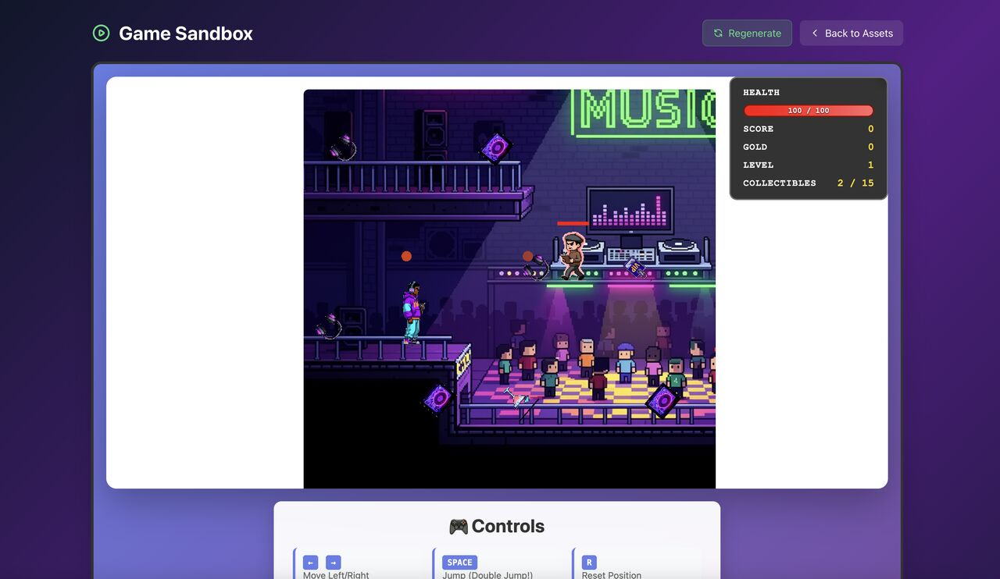
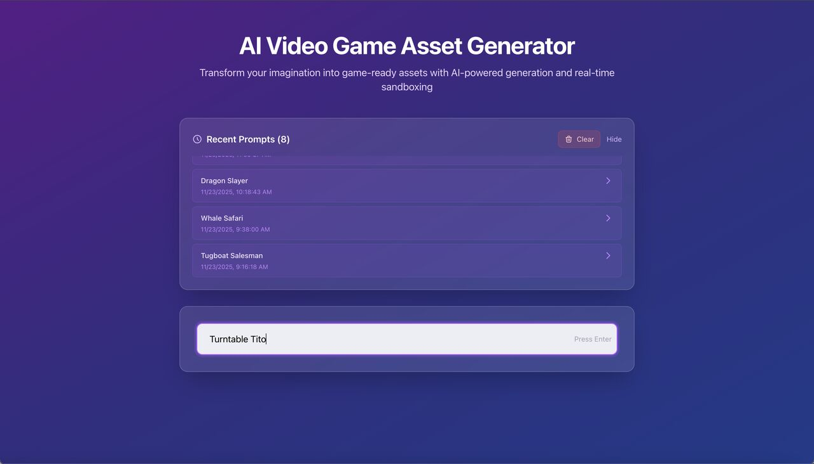
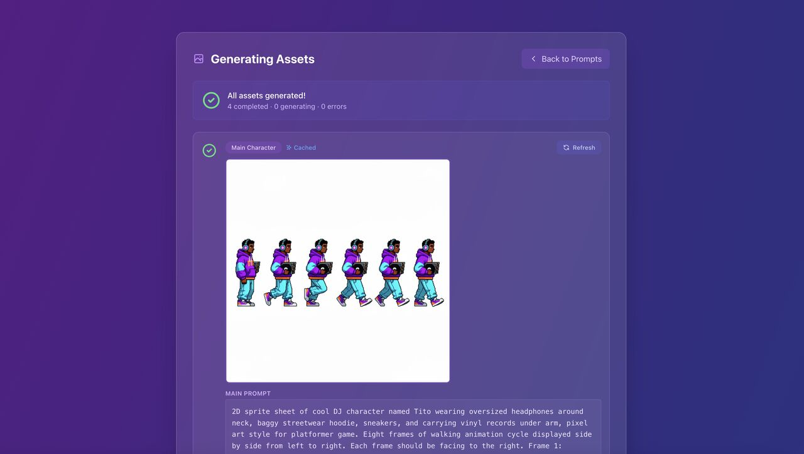
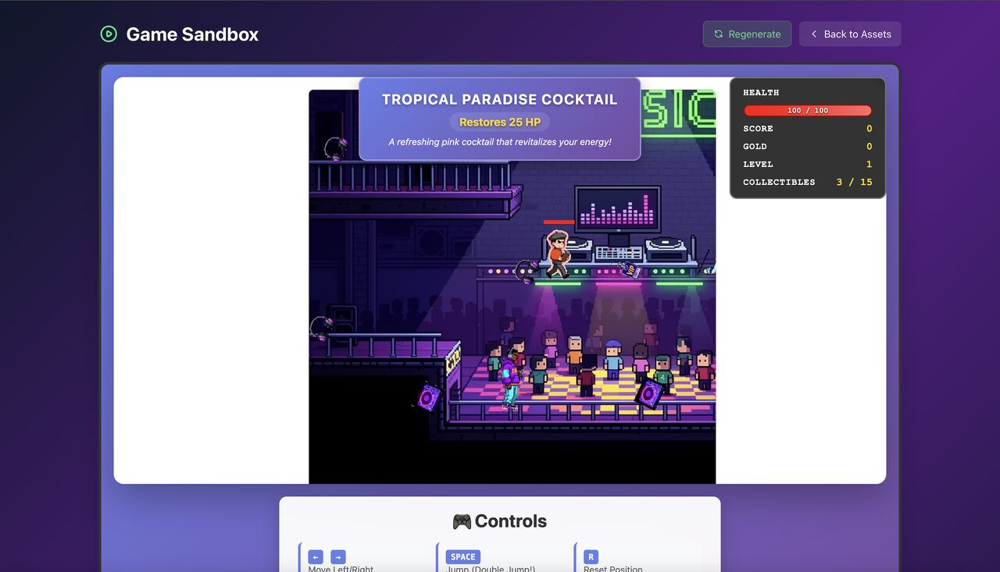

<div align="center">

# 🎮 AI Video Game Asset Generator & Sandbox

**Type a game theme → get AI-generated sprite sheets → play the game in your browser.**

An end-to-end pipeline that turns a one-line idea ("Turntable Tito") into a fully playable
2D platformer: Claude writes the asset prompts, FAL AI renders the art, and a Phaser game
is generated and embedded — complete with mobs, collectibles, and level progression.



</div>

## How It Works

| 1 · Describe | 2 · Generate | 3 · Play |
|---|---|---|
| Enter a theme on the home page. Claude (`claude-sonnet-4-5`) writes detailed image prompts for four assets: **main character**, **mob**, **background**, and **collectible item**. | Prompts are editable, then rendered in parallel by FAL AI as sprite sheets and scenes, with per-asset regeneration and cache badges. | The backend detects walkable platforms in the background (Claude vision), extracts animation frames, segments collectibles, and emits a playable Phaser game in the browser. |

<table>
  <tr>
    <td align="center"><br><sub><b>Home</b> — theme input + prompt history</sub></td>
    <td align="center"><br><sub><b>Asset generation</b> — sprite-sheet walk cycles</sub></td>
  </tr>
  <tr>
    <td align="center"><br><sub><b>Game sandbox</b> — playable platformer with HUD</sub></td>
    <td align="center"><br><sub><b>Collectibles</b> — AI-named items with status effects</sub></td>
  </tr>
</table>

## Features

- 🧠 **Theme → assets** — one prompt becomes four coordinated asset prompts (character, mob, background, collectible), each with editable variations
- 🖼️ **Parallel image generation** — FAL AI renders all assets concurrently, with per-asset regeneration
- 🕹️ **Playable sandbox** — double jump, one-way platforms, mobs with health bars and projectiles, win-by-collecting-everything, and escalating difficulty per level
- 👁️ **Vision-powered pipeline** — Claude vision detects walkable platforms in the generated background, analyzes sprite-sheet layouts, and names collectibles with status effects (health / score / gold)
- 📊 **Dynamic HUD** — health bar plus stats that appear based on the collectibles in your game
- ⚡ **Component-level caching** — backgrounds, characters, mobs, and collectibles are cached independently for 80–90% faster regeneration
- 🕒 **Prompt history** — reload any previous theme instantly from cache
- 📚 **Interactive API docs** — Swagger UI at `/docs`, ReDoc at `/redoc`

## Quick Start

You'll need two API keys: [Anthropic](https://console.anthropic.com/) and [FAL](https://fal.ai/dashboard/keys).

### Backend (Python 3.12+ · [uv](https://github.com/astral-sh/uv))

```bash
cd backend
uv sync
cp .env.example .env   # then add BOTH keys to .env:
                       #   ANTHROPIC_API_KEY=sk-ant-...
                       #   FAL_KEY=...
uv run python main.py  # → http://localhost:8000
```

### Frontend (Node 18+)

```bash
cd frontend
npm install
npm run dev            # → http://localhost:5173
```

Open `http://localhost:5173`, enter a theme, generate assets, and hit **Generate Sandbox**.

**Controls:** ← / → move · `SPACE` jump (double jump!) · `R` reset position · `ESC` restart

## Project Structure

```
ai-game-sandbox/
├── frontend/                        # React 18 + TypeScript + Vite + Tailwind
│   └── src/
│       ├── pages/                   # Home → GenerateAssets → GameSandbox
│       ├── components/              # PromptInput, AssetPromptsDisplay, CachedPrompts, ...
│       └── context/                 # AssetContext (shared asset state)
└── backend/                         # FastAPI + uv
    ├── main.py                      # API server (port 8000)
    ├── game_generator.py            # asset URLs → playable game pipeline (also a CLI)
    ├── image_generation/            # FAL AI image generation + CLI
    ├── sprite_processing/           # sprite-sheet analysis, background removal, frame extraction
    ├── scene_builder/               # platform detection, scene config, Phaser HTML export
    ├── cache_manager.py             # prompt cache
    ├── image_cache_manager.py       # generated-image URL cache
    ├── game_cache_manager.py        # whole-game cache (legacy)
    └── component_cache_manager.py   # per-component cache
```

## API

Full interactive docs at `http://localhost:8000/docs` once the backend is running.

| Method | Endpoint | Purpose |
|---|---|---|
| `POST` | `/generate-asset-prompts` | Theme → asset prompt bundle (cached) |
| `POST` | `/generate-image-asset` | Prompt → image via FAL AI (cached, `force_regenerate` supported) |
| `POST` | `/generate-game` | Asset URLs → playable Phaser game HTML |
| `GET` | `/cached-prompts` | List cached themes |
| `POST` | `/fetch-cached-prompt` | Fetch full cached result for a theme |
| `GET` | `/component-cache/stats` | Component cache statistics |
| `DELETE` | `/cache` · `/image-cache` · `/game-cache` · `/component-cache` | Clear the respective cache |

## CLI Tools

Run from `backend/`:

```bash
# Generate an image (default model: fal-ai/alpha-image-232/text-to-image)
uv run generate-image "A heroic knight character, white background" --images ./reference.png

# Process a sprite sheet into game-ready frames
uv run process-sprites --help

# Build a playable game straight from local files
uv run python game_generator.py --character sprites.png --background bg.png
```

See [`backend/README.md`](backend/README.md) and [`backend/image_generation_README.md`](backend/image_generation_README.md) for all options.

## Caching

Games are cached at the **component level** — background, character, mob, and collectible are processed and stored independently, so changing one asset only regenerates that component (80–90% faster). Details in [COMPONENT_CACHING_SYSTEM.md](COMPONENT_CACHING_SYSTEM.md) and [CACHING_IMPLEMENTATION_SUMMARY.md](CACHING_IMPLEMENTATION_SUMMARY.md).

## Tech Stack

| Layer | Technology |
|---|---|
| Frontend | React 18 · TypeScript 5 · Vite 5 · Tailwind CSS 3 · React Router 6 |
| Backend | FastAPI · uvicorn · Python 3.12 · uv |
| AI | Claude Sonnet 4.5 (`claude-sonnet-4-5`) for prompts & vision · FAL AI for images |
| Game engine | Phaser 3.70 (self-contained generated HTML) |

## License

MIT
